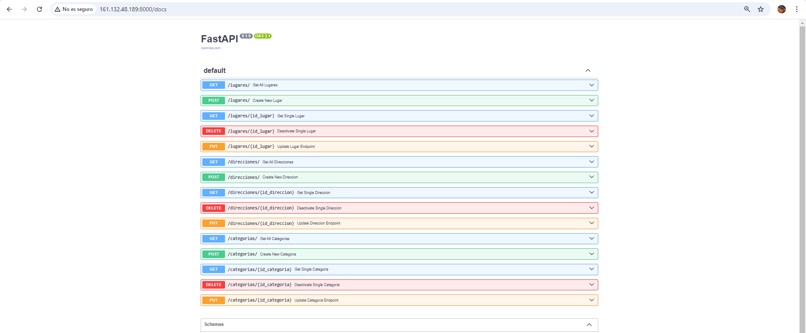

Configuracion de Gitflow

## API de Eventos

#### Integrantes:

Mayner Gonzalo Anahua Coaquira			(2020067145)
Justin Zinedine Zevallos Purca			(2020066924)

#### Comandos utilizados:

python -m venv env

.\env\Scripts\activate

deactivate

pip install Flask

pip install Flask-SQLAlchemy

pip freeze > requirements.txt

python run.py

Algunas Capturas de prueba

